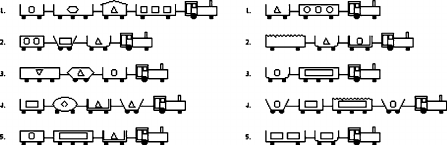

# Neural-Symbolic Learner for Michalski's train problem

* open and run `mudar_nome_do_arquivo.ipynb` on google colab or localy with jupyter notebook
* the main dependencies are shown on the first cell to be run. It installs tensorflow, keras and other modules that are used in the notebook.

## Michalski’s train details

* The problem: 
  * there are **_ten_ railway trains**;
  * five are travelling east;
  * five are travelling west;
  * each train comprises a locomotive pulling wagons;
* Whether a particular train is travelling towards the east or towards the west is determined by some properties of that train:
  * appended wagons;
  * short or long wagons;
  * closed or open wagons;
  * jagged or not;
  * shaped the wagons contain;
  * how many shapes;
  * and more.

* The data describes different features of trains. The positive examples are the trains on the left in the **figure below** and the negative examples are the trains on the right:

[Fig. 1]

    The task of the learner is to find characteristics that determine the direction the train take.